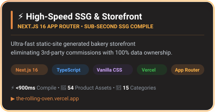
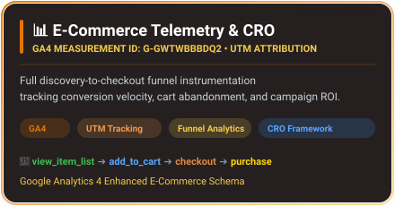
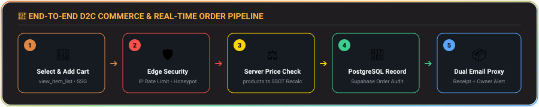
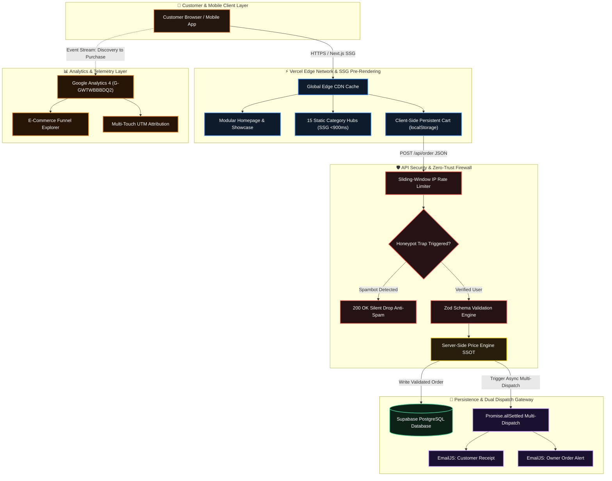

<!-- ═══════════════════════════════════════════════════════════════════════════════════ -->
<!-- ░░░  THE ROLLING OVEN — ARTISAN BAKERY & D2C GROWTH ENGINE  ░░░░░░░░░░░░░░░░░░░░ -->
<!-- ═══════════════════════════════════════════════════════════════════════════════════ -->

<!-- ╔═══════════════════════════════╗ -->
<!-- ║   ANIMATED GRADIENT HEADER    ║ -->
<!-- ╚═══════════════════════════════╝ -->
<div align="center">


<br><br>

<!-- Animated Typing SVG (Single-line, no text overflow) -->
<a href="https://git.io/typing-svg">
  
</a>

<br><br>

<!-- Badges Row 1: Deployment & Stack -->
<a href="https://the-rolling-oven.vercel.app">
  
</a>
&nbsp;
<a href="https://nextjs.org/">
  
</a>
&nbsp;
<a href="https://www.typescriptlang.org/">
  
</a>

<br><br>

<!-- Badges Row 2: Backend, Analytics & Metrics -->
<a href="https://supabase.com/">
  
</a>
&nbsp;
<a href="https://analytics.google.com/">
  
</a>
&nbsp;

&nbsp;


<br><br>

<p align="center">
  <b>A production-grade, direct-to-consumer e-commerce storefront engineered to eliminate aggregator commissions, capture 100% first-party customer data, and deliver sub-second SSG rendering across Western Tamil Nadu.</b>
</p>

[🥐 Live Storefront](https://the-rolling-oven.vercel.app) • [🏗️ System Architecture](#️-system-architecture) • [🛒 Order Pipeline](#-real-time-d2c-order-pipeline) • [📊 GA4 Telemetry](#-analytics--growth-intelligence-ga4) • [🗂️ Project Structure](#️-interactive-project-structure)

</div>

<!-- Animated Glowing Divider -->


<!-- ╔═══════════════════════════════╗ -->
<!-- ║       EXECUTIVE SUMMARY       ║ -->
<!-- ╚═══════════════════════════════╝ -->

<h2>📌 Executive Overview &amp; Problem Statement</h2>

**The Rolling Oven** is an artisan homemade bakery operating across **Sathyamangalam, Erode, Gobichettipalayam, and Coimbatore** in Tamil Nadu, India.

Traditional food businesses lose **25% to 35% of their top-line revenue** to commercial aggregator commissions (Swiggy/Zomato) and surrender direct customer ownership. **The Rolling Oven platform** was engineered from the ground up as a **high-converting, independent D2C commerce architecture**:

```yaml
Storefront Status   : Production Prototype Live on Vercel Edge
Target Demographics : Western Tamil Nadu (Sathyamangalam • Erode • Gobi • Coimbatore)
Core Problem Solved : 0% Aggregator Commission • 100% First-Party Data Retention
Engineering Stack   : Next.js 16 (SSG) • TypeScript • Supabase PostgreSQL • GA4 Telemetry
```

<!-- Animated Glowing Divider -->


<!-- ╔═══════════════════════════════╗ -->
<!-- ║      FROSTED GLASS CARDS      ║ -->
<!-- ╚═══════════════════════════════╝ -->

<h2>✨ Engineering Highlights &amp; Core Pillars</h2>

<div align="center">

<!-- Row 1: High-Speed SSG + GA4 Telemetry -->
<a href="https://the-rolling-oven.vercel.app">
  
</a>
&nbsp;&nbsp;
<a href="#-analytics--growth-intelligence-ga4">
  
</a>

<br><br>

<!-- Row 2: Zero-Trust Security + Supabase Ledger -->
<a href="#️-security--zero-trust-engineering">
  
</a>
&nbsp;&nbsp;
<a href="#️-system-architecture">
  
</a>

</div>

<!-- Animated Glowing Divider -->


<!-- ╔═══════════════════════════════╗ -->
<!-- ║    ORDER PIPELINE BANNER      ║ -->
<!-- ╚═══════════════════════════════╝ -->

<h2>🛒 Real-Time D2C Order Pipeline</h2>

<div align="center">
  
</div>

<br>

| Stage | Process | Security / Business Mechanism |
|---|---|---|
| **1. Discovery & Cart** | Customer selects artisan treats via SSG category hubs | Trigger `view_item_list` & `add_to_cart` in GA4 |
| **2. Edge Guard** | Payload submitted to `/api/order` | IP sliding-window rate limit (5 req/min) + hidden `b_website` honeypot |
| **3. Zero-Trust Recalculation** | Server re-fetches price list from `products.ts` | Discards client-sent amounts, recalculates true order total |
| **4. Supabase Ledger** | Validated order schema committed | PostgreSQL audit row written with timestamp and item array |
| **5. Dual Proxy Dispatch** | Non-blocking `Promise.allSettled` | Generates customer confirmation receipt + owner immediate alert |

<!-- Animated Glowing Divider -->


<!-- ╔═══════════════════════════════╗ -->
<!-- ║      SYSTEM ARCHITECTURE      ║ -->
<!-- ╚═══════════════════════════════╝ -->

<h2>🏗️ System Architecture</h2>

<p align="center">
  <b>A modular, fault-tolerant edge architecture bridging static pre-rendering, telemetry, and transactional persistence.</b>
</p>



<!-- Animated Glowing Divider -->


<!-- ╔═══════════════════════════════╗ -->
<!-- ║       GA4 TELEMETRY           ║ -->
<!-- ╚═══════════════════════════════╝ -->

<h2>📈 Analytics &amp; Growth Intelligence (GA4)</h2>

The platform implements an **MBA-Calibrated Analytics Framework** tracking every micro-conversion across the discovery-to-checkout pipeline:

### 1. Funnel Telemetry Milestones
* `view_item_list` ➔ Logged across category routes, trending grids, and infinite sliders.
* `select_item` ➔ Captured when customers inspect modal descriptions and customize flavors.
* `add_to_cart` ➔ Synchronized with quantity selectors and cart drawer state.
* `begin_checkout` ➔ Fired upon form modal focus and address entry.
* `purchase` ➔ Verified transaction event with server-validated revenue payload.

### 2. Multi-Touch UTM Campaign Attribution
Standardized campaign parameters identify high-performing traffic channels:
```http
https://the-rolling-oven.vercel.app/?utm_source=instagram&utm_medium=reel_organic&utm_campaign=chocolava_viral
```

### 3. Regional Demand Clustering
Telemetry groups user location intent across Western Tamil Nadu:
* **Sathyamangalam Zone:** Hyper-local 30-minute fresh delivery ring.
* **Coimbatore & Erode Hubs:** High Average Order Value (AOV) weekend celebration & event catering pre-orders.
* **Gobichettipalayam Ring:** Repeat weekly customer subscriptions.

<!-- Animated Glowing Divider -->


<!-- ╔═══════════════════════════════╗ -->
<!-- ║   INTERACTIVE PROJECT TREE    ║ -->
<!-- ╚═══════════════════════════════╝ -->

<h2>🗂️ Interactive Project Structure</h2>

<details open>
<summary><h3>📂 <code>src/app/</code> — Next.js 16 App Router &amp; Dynamic SSG Routes <sub>(Click to collapse ▾)</sub></h3></summary>
<br>

| Path | Type | Role & Description |
|---|---|---|
| [`src/app/page.tsx`](file:///src/app/page.tsx) | Page | Modular homepage with hero showcase, interactive infinite shelf & toast triggers |
| [`src/app/category/[slug]/`](file:///src/app/category) | Route | 15 dynamic SSG category hubs compiled statically in **&lt;900ms** |
| [`src/app/layout.tsx`](file:///src/app/layout.tsx) | Layout | Root viewport shell with Google Analytics 4 (`G-GWTWBBBDQ2`) & Schema.org JSON-LD |
| [`src/app/globals.css`](file:///src/app/globals.css) | Styles | Zero-framework luxury CSS design system with custom CSS variables & animations |
| [`src/app/sitemap.ts`](file:///src/app/sitemap.ts) | SEO | Automated XML sitemap generation indexing all dynamic category routes |
| [`src/app/robots.ts`](file:///src/app/robots.ts) | SEO | Crawler directives optimizing search indexing for local bakery keywords |

</details>

<details open>
<summary><h3>📂 <code>src/app/api/</code> — Serverless Security &amp; Dispatch Endpoints <sub>(Click to collapse ▾)</sub></h3></summary>
<br>

| Path | Endpoint | Security &amp; Business Implementation |
|---|---|---|
| [`src/app/api/order/route.ts`](file:///src/app/api/order/route.ts) | `POST /api/order` | IP rate-limiting, honeypot filter, Zod schema validation, DB insert & dual EmailJS dispatch |
| [`src/app/api/contact/route.ts`](file:///src/app/api/contact/route.ts) | `POST /api/contact` | Rate-limited customer inquiry handler with anti-spam honeypot defense |
| [`src/app/api/feedback/route.ts`](file:///src/app/api/feedback/route.ts) | `POST /api/feedback` | Customer review submission with sanitization and moderation checks |

</details>

<details open>
<summary><h3>📂 <code>src/lib/</code> — Core Business Logic, Security &amp; SSOT Catalog <sub>(Click to collapse ▾)</sub></h3></summary>
<br>

| Path | Role | Key Capabilities |
|---|---|---|
| [`src/lib/products.ts`](file:///src/lib/products.ts) | SSOT Catalog | 54-item verified catalog with pricing, flavor variants, categories, and image mappings |
| [`src/lib/rate-limit.ts`](file:///src/lib/rate-limit.ts) | Security Guard | In-memory sliding-window IP rate limiter preventing automated DDoS and spam bursts |
| [`src/lib/validations.ts`](file:///src/lib/validations.ts) | Type Integrity | Strict Zod validation schemas verifying order payloads and contact submissions |

</details>

<details>
<summary><h3>📂 <code>public/</code> &amp; <code>assets/</code> — Visual Assets, Photography &amp; Glass Cards <sub>(Click to expand ▾)</sub></h3></summary>
<br>

| Path | Asset Type | Description |
|---|---|---|
| `public/images/products/` | Media | 54 high-resolution bakery product photographs synchronized with catalog data |
| `assets/header-banner.svg` | Vector | Native SVG glowing header with amber wave curves |
| `assets/cart-flow-banner.svg` | Vector | 5-stage interactive D2C order pipeline visual |
| `assets/card-*.svg` | Vector | 4 frosted glass cards for Engine, Telemetry, Security & Dispatch |
| `assets/footer-banner.svg` | Vector | Matching glowing footer banner |

</details>

<!-- Animated Glowing Divider -->


<!-- ╔═══════════════════════════════╗ -->
<!-- ║       SECURITY MATRIX         ║ -->
<!-- ╚═══════════════════════════════╝ -->

<h2>🛡️ Security &amp; Zero-Trust Engineering</h2>

| Layer | Technique | Engineering &amp; Business Impact |
|---|---|---|
| **Price Protection** | Server-side recalculation via `products.ts` | Eliminates client-side payload tampering and price spoofing. |
| **DDoS Defense** | Sliding-window IP limiter (5 req/min) | Shields order and inquiry API endpoints from automated spam storms. |
| **Bot Mitigation** | Hidden honeypot field (`b_website`) | Silently drops spambot submissions without consuming backend resources. |
| **Data Integrity** | Strict Zod schema typing | Guarantees all names, phones, addresses, and items match expected types. |
| **Dual Dispatch** | `Promise.allSettled` asynchronous proxy | Guarantees customer receipt delivery without dropping orders if quotas surge. |
| **Local SEO** | Schema.org `Bakery`, `Product`, `ItemList` | Powers Google Search Rich Snippets for hyper-local bakery queries. |

<!-- Animated Glowing Divider -->


<!-- ╔═══════════════════════════════╗ -->
<!-- ║     LOCAL SETUP GUIDE         ║ -->
<!-- ╚═══════════════════════════════╝ -->

<h2>💻 Local Development Setup</h2>

### Prerequisites
* **Node.js**: `v18.17.0+` or `v20.x`
* **Package Manager**: `npm` or `yarn`

```bash
# 1. Clone the repository
git clone https://github.com/sugan0025/the-rolling-oven.git
cd the-rolling-oven

# 2. Install dependencies
npm install

# 3. Configure environment variables (.env.local)
cp .env.example .env.local
# Set NEXT_PUBLIC_SUPABASE_URL, NEXT_PUBLIC_SUPABASE_ANON_KEY, and EmailJS keys

# 4. Start Turbopack development server
npm run dev
```

Visit [`http://localhost:3000`](http://localhost:3000) to explore the local development environment.

<!-- Animated Glowing Divider -->


<!-- ╔═══════════════════════════════╗ -->
<!-- ║    AUTHOR & CREDITS           ║ -->
<!-- ╚═══════════════════════════════╝ -->

<h2>👨‍💻 Author &amp; Engineering Credits</h2>

<div align="center">

```yaml
Developer & Analyst : Suganesan S (Sugan)
Academic Program    : MBA in Business Analytics & Marketing | School of Management Studies, BIT Sathy
Core Expertise      : D2C E-Commerce Engineering • GA4 Web Telemetry • Business Intelligence (Power BI)
Live Platform       : https://the-rolling-oven.vercel.app
GitHub Profile      : https://github.com/sugan0025
```

<a href="https://the-rolling-oven.vercel.app">
  
</a>
&nbsp;
<a href="https://github.com/sugan0025">
  
</a>

<br><br>


</div>
