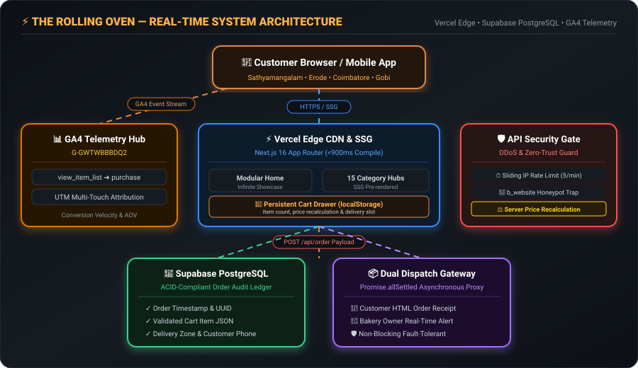

<!-- ═══════════════════════════════════════════════════════════════════════════════════ -->
<!-- ░░░  THE ROLLING OVEN — ARTISAN BAKERY & D2C GROWTH ENGINE  ░░░░░░░░░░░░░░░░░░░░ -->
<!-- ═══════════════════════════════════════════════════════════════════════════════════ -->

<!-- ╔═══════════════════════════════╗ -->
<!-- ║   ANIMATED GRADIENT HEADER    ║ -->
<!-- ╚═══════════════════════════════╝ -->
<div align="center">


<br><br>

<!-- Animated Typing SVG (Single-line, no text overflow) -->
<a href="https://git.io/typing-svg">
  
</a>

<br><br>

<!-- Badges Row 1: Deployment & Stack -->
<a href="https://the-rolling-oven.vercel.app">
  
</a>
&nbsp;
<a href="https://nextjs.org/">
  
</a>
&nbsp;
<a href="https://www.typescriptlang.org/">
  
</a>

<br><br>

<!-- Badges Row 2: Optimization, Security & Architecture -->

&nbsp;

&nbsp;

&nbsp;


<br><br>

<p align="center">
  <b>A production-grade, direct-to-consumer e-commerce storefront engineered to eliminate aggregator commissions, capture 100% first-party customer data, and deliver sub-second SSG rendering with offline PWA reliability across Western Tamil Nadu.</b>
</p>

[🥐 Live Storefront](https://the-rolling-oven.vercel.app) • [⚡ Performance & PWA](#-performance-pwa--asset-optimization) • [🛡️ Security & Privacy](#️-security-privacy--zero-trust-engineering) • [🛒 Order Pipeline](#-real-time-d2c-order-pipeline) • [📊 GA4 Telemetry](#-analytics--growth-intelligence-ga4) • [🗂️ Project Structure](#️-project-architecture--directory-map)

</div>

<!-- Animated Glowing Divider -->


<!-- ╔═══════════════════════════════╗ -->
<!-- ║       EXECUTIVE SUMMARY       ║ -->
<!-- ╚═══════════════════════════════╝ -->

<h2>📌 Executive Overview &amp; Problem Statement</h2>

**The Rolling Oven** is an artisan homemade bakery operating across **Sathyamangalam, Erode, Gobichettipalayam, and Coimbatore** in Tamil Nadu, India.

Traditional food businesses lose **25% to 35% of their top-line revenue** to commercial aggregator commissions (Swiggy/Zomato) and surrender direct customer ownership. **The Rolling Oven platform** was engineered from the ground up as a **high-converting, independent D2C commerce architecture**:

```yaml
Storefront Status   : Production Live on Vercel Edge (SSG + Edge Functions)
Target Demographics : Western Tamil Nadu (Sathyamangalam • Erode • Gobi • Coimbatore)
Core Problem Solved : 0% Aggregator Commission • 100% First-Party Data Retention
Engineering Stack   : Next.js 16 (SSG) • TypeScript • PWA Service Worker • Supabase • GA4
Compliance & A11y   : WCAG 2.1 AA Compliant • Google Consent Mode v2 • Full CSP Hardening
Asset Optimization  : Sharp WebP Pipeline (-84.3% Payload / 2.53 MB total catalog)
```

<!-- Animated Glowing Divider -->


<!-- ╔═══════════════════════════════╗ -->
<!-- ║      FROSTED GLASS CARDS      ║ -->
<!-- ╚═══════════════════════════════╝ -->

<h2>✨ Engineering Highlights &amp; Core Pillars</h2>

<div align="center">

<!-- Row 1: High-Speed SSG + GA4 Telemetry -->
<a href="https://the-rolling-oven.vercel.app">
  
</a>
&nbsp;&nbsp;
<a href="#-analytics--growth-intelligence-ga4">
  
</a>

<br><br>

<!-- Row 2: Zero-Trust Security + Supabase Ledger -->
<a href="#️-security-privacy--zero-trust-engineering">
  
</a>
&nbsp;&nbsp;
<a href="#️-system-architecture">
  
</a>

</div>

<!-- Animated Glowing Divider -->


<!-- ╔═══════════════════════════════╗ -->
<!-- ║   PERFORMANCE & PWA SECTION   ║ -->
<!-- ╚═══════════════════════════════╝ -->

<h2>⚡ Performance, PWA &amp; Asset Optimization</h2>

Recent production audit upgrades eliminated heavy payload bottlenecks and delivered a 100% installable, offline-resilient user experience:

### 1. WebP Automated Asset Pipeline (`scripts/optimize-images.mjs`)
* **84.3% Bandwidth Reduction**: Batch-compressed 59 catalog and interface images with `sharp` at Quality 82 with alpha transparency.
* **Payload Drop**: Slashed image payload from **16.16 MB down to 2.53 MB** (saving **13.63 MB** on initial discovery).
* **Core Web Vitals Impact**: Drastically improved **Largest Contentful Paint (LCP)** and **First Input Delay (FID)** on 3G/4G mobile networks across Tamil Nadu.
* **NPM Build Integration**: Run anytime via `npm run optimize:images`. Original high-res PNGs remain preserved as fallbacks.

### 2. Progressive Web App (PWA) &amp; Offline Resilience
* **Custom Service Worker (`public/sw.js`)**:
  * **Stale-While-Revalidate**: Aggressively caches static assets (images, fonts, stylesheets, JS).
  * **Network-First Navigation**: Ensures customers always get the latest bakery menu while automatically serving `/offline.html` if signal drops.
* **Branded Offline Fallback (`public/offline.html`)**: Warm bakery UI with *"Oven's Ready, But You're Offline"* messaging, automatic retry, and direct phone dialer.
* **Installability Ready**: Configured `manifest.json` with multi-density icons (`192x192`, `512x512`, and `maskable`) for seamless "Add to Home Screen" on Android & iOS.

### 3. Accessibility Hardening (WCAG 2.1 AA)
* **Color Contrast Tuning**: Adjusted `--text-muted` to `#9E8468` (5.34:1) and `--danger` to `#EF5350` (5.40:1) against dark chocolate `#1A0F08` to satisfy WCAG AA 4.5:1 minimums.
* **Keyboard Navigation**: Skip-to-content link, gold `:focus-visible` rings on interactive elements, and strict ARIA roles (`dialog`, `navigation`, `radiogroup`, `aria-live`).
* **Motion Accessibility**: Full `prefers-reduced-motion` overrides disabling animations for sensitive users.

<!-- Animated Glowing Divider -->


<!-- ╔═══════════════════════════════╗ -->
<!-- ║    ORDER PIPELINE BANNER      ║ -->
<!-- ╚═══════════════════════════════╝ -->

<h2>🛒 Real-Time D2C Order Pipeline</h2>

<div align="center">
  
</div>

<br>

| Stage | Process | Security / Business Mechanism |
|---|---|---|
| **1. Discovery & Cart** | Customer selects artisan treats via SSG category hubs | Trigger `view_item_list` & `add_to_cart` in GA4 |
| **2. Edge Guard** | Payload submitted to `/api/order` | IP sliding-window rate limit (5 req/min) + hidden `b_website` honeypot |
| **3. Client Validation** | Real-time input checking | 10-digit Indian phone (`^[6-9]\d{9}$`), 6-digit PIN, empty cart guard |
| **4. Zero-Trust Recalculation** | Server re-fetches price list from `products.ts` | Discards client-sent amounts, recalculates true order total |
| **5. Supabase Ledger** | Validated order schema committed | PostgreSQL audit row written with timestamp and item array |
| **6. Dual Proxy Dispatch** | Non-blocking `Promise.allSettled` | Generates customer confirmation receipt + owner immediate alert |

<!-- Animated Glowing Divider -->


<!-- ╔═══════════════════════════════╗ -->
<!-- ║      SYSTEM ARCHITECTURE      ║ -->
<!-- ╚═══════════════════════════════╝ -->

<h2>🏗️ System Architecture</h2>

<p align="center">
  <b>A modular, fault-tolerant edge architecture bridging static pre-rendering, telemetry, and transactional persistence.</b>
</p>

<div align="center">
  
</div>

<br>

| Architectural Tier | Implementation &amp; Technologies | Core Responsibilities |
|---|---|---|
| **📱 Mobile &amp; Client Layer** | PWA, Responsive Glassmorphism, Service Worker | Customer order creation, category exploration, live cart drawer, offline fallback |
| **⚡ Edge CDN &amp; SSG** | Next.js 16 App Router, Vercel Edge Network | Sub-900ms build-time rendering of all category hubs, sitemap, and assets |
| **📊 Telemetry Stream** | Google Analytics 4 (`G-GWTWBBBDQ2`), Consent Mode v2 | Enhanced e-commerce funnel, multi-touch attribution, GDPR/PECR compliance |
| **🛡️ API Security Gate** | Sliding-Window IP Limiter, Honeypot Trap | Anti-spam mitigation (5 req/min), spambot silent drop, Zod schema validation |
| **⚖️ Price Engine** | Server-Side Catalog Recalculation (`products.ts`) | Zero-trust verification discarding client-sent price payloads |
| **💾 Ledger &amp; Proxy** | Supabase PostgreSQL, EmailJS Proxy | ACID order row persistence, `Promise.allSettled` dual email dispatch |

<!-- Animated Glowing Divider -->


<!-- ╔═══════════════════════════════╗ -->
<!-- ║       SECURITY & PRIVACY      ║ -->
<!-- ╚═══════════════════════════════╝ -->

<h2>🛡️ Security, Privacy &amp; Zero-Trust Engineering</h2>

| Layer | Technique | Engineering &amp; Business Impact |
|---|---|---|
| **Privacy / Consent** | Google Consent Mode v2 | Analytics set to `denied` by default. If customer declines, `ga-disable` kills tracking and purges `_ga*` cookies. |
| **CSP Hardening** | Strict Content-Security-Policy | Whitelists GA4, Razorpay, and Supabase; enforces `worker-src 'self' blob:` and `manifest-src 'self'`; blocks object injection. |
| **Transport Security** | HSTS Preload (`max-age=63072000`) | Enforces HTTPS with subdomains and preload flag for zero man-in-the-middle risk. |
| **Price Protection** | Server-side recalculation via `products.ts` | Eliminates client-side payload tampering and price spoofing. |
| **DDoS Defense** | Sliding-window IP limiter (5 req/min) | Shields order and inquiry API endpoints from automated spam storms. |
| **Bot Mitigation** | Hidden honeypot field (`b_website`) | Silently drops spambot submissions without consuming backend resources. |
| **Data Integrity** | Strict Zod schema typing + Client validation | Enforces 10-digit Indian phone regex, 6-digit PIN, and type-safe payloads. |
| **Dual Dispatch** | `Promise.allSettled` asynchronous proxy | Guarantees customer receipt delivery without dropping orders if quotas surge. |
| **Entity Disambiguation** | Schema.org `Bakery` & `FoodEstablishment` | Explicit geo-coordinates (11.5034, 77.2393) preventing search confusion with industrial ovens. |

<!-- Animated Glowing Divider -->


<!-- ╔═══════════════════════════════╗ -->
<!-- ║       GA4 TELEMETRY           ║ -->
<!-- ╚═══════════════════════════════╝ -->

<h2>📈 Analytics &amp; Growth Intelligence (GA4)</h2>

The platform implements an **MBA-Calibrated Analytics Framework** tracking every micro-conversion across the discovery-to-checkout pipeline:

### 1. Funnel Telemetry Milestones
* `view_item_list` ➔ Logged across category routes, trending grids, and infinite sliders.
* `select_item` ➔ Captured when customers inspect modal descriptions and customize flavors.
* `add_to_cart` / `remove_from_cart` ➔ Synchronized with quantity selectors and cart drawer state.
* `begin_checkout` ➔ Fired upon order modal trigger and checkout start.
* `purchase` ➔ Verified transaction event with server-validated revenue payload (both COD and Razorpay online flows).

### 2. Multi-Touch UTM Campaign Attribution
Standardized campaign parameters identify high-performing traffic channels:
```http
https://the-rolling-oven.vercel.app/?utm_source=instagram&utm_medium=reel_organic&utm_campaign=chocolava_viral
```

### 3. Regional Demand Clustering
Telemetry groups user location intent across Western Tamil Nadu:
* **Sathyamangalam Zone:** Hyper-local 30-minute fresh delivery ring.
* **Coimbatore & Erode Hubs:** High Average Order Value (AOV) weekend celebration & event catering pre-orders.
* **Gobichettipalayam Ring:** Repeat weekly customer subscriptions.

<!-- Animated Glowing Divider -->


<!-- ╔═══════════════════════════════╗ -->
<!-- ║    PROJECT ARCHITECTURE MAP   ║ -->
<!-- ╚═══════════════════════════════╝ -->

<h2>🗂️ Real-World Project Tree Structure</h2>

```
the-rolling-oven/
├── 📂 assets/                              # Vector SVGs, SMIL animations & live architecture flows
│   ├── 🎨 architecture-diagram.svg         # Real-time SMIL animated system architecture
│   ├── 🛒 cart-flow-banner.svg             # 5-stage D2C commerce pipeline visual
│   ├── ⚡ card-engine.svg                  # Sub-900ms SSG storefront glass card
│   ├── 📊 card-telemetry.svg               # GA4 e-commerce CRO glass card
│   ├── 🛡️ card-security.svg                # Zero-trust edge firewall glass card
│   ├── 📦 card-dispatch.svg                # Supabase ledger & dual proxy glass card
│   ├── 🌊 header-banner.svg                # SMIL-animated gradient header banner
│   └── 🌊 footer-banner.svg                # SMIL-animated gradient footer banner
│
├── 📂 public/                              # Static client assets, PWA icons & WebP catalog
│   ├── 📂 images/products/                 # 59 WebP optimized catalog assets (84.3% compressed)
│   ├── 📱 icon-192.png / icon-512.png      # High-res PWA application icons
│   ├── 📱 icon-maskable-512.png            # Android adaptive safe-zone maskable icon
│   ├── 🖼️ apple-touch-icon.png / favicon.* # Multi-format branding favicons
│   ├── 📱 manifest.json                    # PWA metadata, theme color, standalone scope
│   ├── ⚡ sw.js                            # Offline caching & Stale-While-Revalidate worker
│   ├── 🥖 offline.html                     # Branded offline fallback with bakery helpline
│   └── 📜 main.js                          # Client-side UI interactions, cart state & push alerts
│
├── 📂 scripts/                             # Build & optimization toolchain
│   ├── ⚡ optimize-images.mjs              # Sharp-powered PNG/JPEG to WebP batch compressor
│   └── 🔄 update-image-references.mjs      # Catalog path synchronization utility
│
├── 📂 src/
│   ├── 📂 app/                             # Next.js 16 App Router Architecture
│   │   ├── 📂 api/                         # Serverless API routes & edge security gates
│   │   │   ├── 📂 abandon-cart/            # Native exit-intent push notification handler
│   │   │   ├── 📂 contact/                 # Customer inquiry endpoint with rate limiting
│   │   │   ├── 📂 feedback/                # Customer review submission endpoint
│   │   │   ├── 📂 order/                   # Transactional checkout & order dispatch
│   │   │   └── 📂 razorpay/create-order/   # Razorpay server-side payment order gateway
│   │   ├── 📂 category/[slug]/             # 7 dynamic SSG category hubs (<900ms compile)
│   │   │   └── 📄 page.tsx                 # Category hero, dynamic item grid & meta tags
│   │   ├── 📂 contact/                     # Hyper-local contact & custom order booking page
│   │   ├── 📂 privacy-policy/              # Legal disclosures & GDPR/DPDP privacy notice
│   │   ├── 📂 refund-policy/               # Perishable goods refund terms
│   │   ├── 📂 shipping-policy/             # Hyper-local doorstep delivery coverage
│   │   ├── 📂 terms-and-conditions/        # E-commerce store conditions of sale
│   │   ├── 🚫 not-found.tsx                # Branded custom 404 page with return CTA
│   │   ├── 🎨 globals.css                  # Zero-framework luxury CSS design system (WCAG AA)
│   │   ├── 📄 layout.tsx                   # Viewport shell + Consent Mode v2 + Bakery Schema
│   │   ├── 📄 page.tsx                     # Modular high-converting homepage (skip-link target)
│   │   ├── 🤖 robots.ts                    # Search engine crawler directives
│   │   └── 🗺️ sitemap.ts                   # Tiered XML sitemap generator with priority weights
│   │
│   ├── 📂 components/                      # Modular React UI component layer
│   │   ├── 📂 home/                        # Homepage presentation modules
│   │   │   ├── 📄 HeroSection.tsx          # Dynamic artisan hero with primary CTA
│   │   │   ├── 📄 ShowcaseSection.tsx      # Infinite trending product showcase
│   │   │   ├── 📄 FavoritesSection.tsx     # Curated artisan specialties
│   │   │   ├── 📄 AboutSection.tsx         # Bakery story & regional coverage
│   │   │   └── 📄 FloatingWhatsApp.tsx     # Direct chat ordering widget
│   │   ├── 📄 CartDrawer.tsx               # Accessible dialog cart with live ARIA regions
│   │   ├── 📄 OrderModal.tsx               # 1-step checkout modal with phone/PIN validation
│   │   ├── 📄 Navbar.tsx                   # Glassmorphic responsive navigation header
│   │   ├── 📄 Footer.tsx                   # Regional footer with WhatsApp & contact links
│   │   ├── 📄 CookieConsent.tsx            # Google Consent Mode v2 banner & cookie purger
│   │   └── 📄 ToastContainer.tsx           # Interactive UI feedback & notification alerts
│   │
│   └── 📂 lib/                             # Single Source of Truth & security engine
│       ├── 📜 products.ts                  # SSOT bakery catalog with WebP image references
│       ├── 🛡️ rate-limit.ts                # In-memory sliding-window IP rate limiter
│       └── 🛡️ validations.ts               # Strict Zod schema typing for order payloads
│
├── ⚙️ next.config.mjs                      # CSP headers, HSTS preload & worker permissions
├── ⚙️ tsconfig.json                        # Strict TypeScript compiler options
└── 📦 package.json                         # Dependencies (Next.js 16, Sharp, Supabase, Zod)
```

<!-- Animated Glowing Divider -->


<!-- ╔═══════════════════════════════╗ -->
<!-- ║     LOCAL SETUP GUIDE         ║ -->
<!-- ╚═══════════════════════════════╝ -->

<h2>💻 Local Development &amp; Tooling Setup</h2>

### Prerequisites
* **Node.js**: `v18.17.0+` or `v20.x`
* **Package Manager**: `npm`

```bash
# 1. Clone the repository
git clone https://github.com/sugan0025/the-rolling-oven.git
cd the-rolling-oven

# 2. Install dependencies (includes Next.js 16, Sharp, Supabase, Zod)
npm install

# 3. Run image optimization pipeline (optional — already compiled in repo)
npm run optimize:images

# 4. Start local Turbopack development server
npm run dev

# 5. Compile production build (verifies SSG, routes & TypeScript)
npm run build
```

Visit [`http://localhost:3000`](http://localhost:3000) to inspect the local storefront and PWA service worker.

<!-- Animated Glowing Divider -->


<!-- ╔═══════════════════════════════╗ -->
<!-- ║    AUTHOR & CREDITS           ║ -->
<!-- ╚═══════════════════════════════╝ -->

<h2>👨‍💻 Author &amp; Engineering Credits</h2>

<div align="center">

```yaml
Developer & Analyst : Suganesan S (Sugan)
Academic Program    : MBA in Business Analytics & Marketing | School of Management Studies, BIT Sathy
Core Expertise      : D2C E-Commerce Engineering • GA4 Web Telemetry • Business Intelligence (Power BI)
Live Platform       : https://the-rolling-oven.vercel.app
GitHub Profile      : https://github.com/sugan0025
```

<a href="https://the-rolling-oven.vercel.app">
  
</a>
&nbsp;
<a href="https://github.com/sugan0025">
  
</a>

<br><br>


</div>
